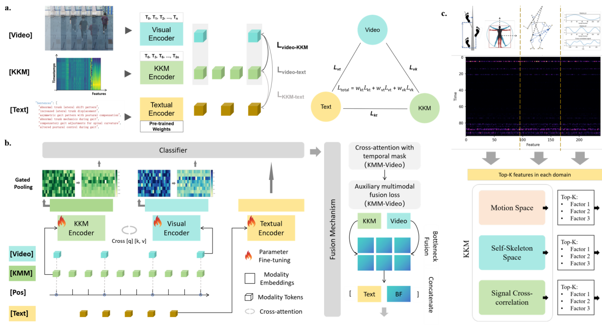

# ScoliDetect

Explainable multimodal screening of adolescent idiopathic scoliosis (AIS) from monocular gait video. A pose-derived **Kinematic Knowledge Map (KKM)** is aligned with the video clip and a short kinematic text prompt, then fused for a binary referral decision and a factor-level readout.

<div align="center">



*<strong>a</strong>, Trimodal contrastive pretraining aligns video, KKM, and text encoders. <strong>b</strong>, Supervised screening head with bidirectional video–KKM cross-attention, gated pooling, bottleneck fusion, and optional auxiliary alignment loss. <strong>c</strong>, Fixed-index KKM domains (motion, skeleton, signal) used for top-<em>k</em> factor readouts.*

</div>

[](https://github.com/Oli21-chen/ScoliDetect_HKU_SpineSeek_AISscreening)
[](LICENSE)

ScoliDetect is an assistive **referral-triage** model for use under a standardized capture protocol. It does not replace clinical examination or radiographic Cobb-angle measurement.

---

## What the model consumes

Each gait cycle is packed into three aligned inputs.

| Modality | Tensor | How it is built |
| --- | --- | --- |
| Video | `32 × 224 × 224 × 3` RGB | Evenly sampled frames from the trimmed walking clip |
| KKM | `96 × 238` | Pose features resampled onto 96 timesteps |
| Text | token sequence, max length 64 | Rule-based gait phrases, mean-pooled by a sentence encoder |

The screening label is binary at a Cobb threshold of 11°. Subject-level splits keep every trial from one person inside a single partition.

### KKM layout (238 factors)

`GetAllFeatures()` in `data_processing/utils/utili_Getpose_v4.py` concatenates four blocks from 17 YOLOv8 landmarks. Interpretability code groups those blocks into three domains (`utils/km_interpretability_core6.py`):

| Domain | Indices | Blocks | Contents |
| --- | --- | --- | --- |
| Motion | 0–33 | `embed_coors` (34) | Hip-centered, scale-normalized `(x, y)` of the 17 landmarks |
| Skeleton | 34–171 | `dis_embedders` (106) + `ang_embedders` (32) | Signed inter-landmark offsets and joint angles |
| Signal | 172–237 | `gait_phases` (66) | Phase and cross-signal descriptors over the cycle |

The named index of every factor is in [`data_processing/utils/feature_index_table_238.md`](data_processing/utils/feature_index_table_238.md). Because each column has a fixed biomechanical meaning, attributions can be read as factor indices and gait phases rather than as pixel saliency. Those attributions are correlates of the trained classifier, not causal claims.

---

## Pipeline

```text
gait video
  → YOLOv8 pose (17 landmarks) and clip trimming
  → KKM (96 × 238) + 32-frame video + kinematic text
  → peak-anchored PKL patches
  → trimodal contrastive pretraining (encoder init)
  → supervised KVT fine-tuning (screening head)
  → external metrics, subgroup curves, factor attribution
  → optional few-shot head-only post-training
```

1. **Pose and trimming.** `data_processing/main/step_1_*.py` estimates pose, trims the walking bout, and writes pose CSV plus a short video. `1.5_invarientpose.py` applies the invariant-pose normalization used before feature extraction.
2. **Sampling.** `data_processing/main/02_Sampling.py` (and `tools/gait_pkl_stage3_PeakAchor.py`) peak-anchors the cycle and writes PKL patches: KKM length 96, video length 32 at 224×224. `tools/gait_pkl_stage1_raw.py` writes the unanchored control set used to compare registration.
3. **Text.** `get_prompts/` turns pose time series into general and subject-level gait sentences. The method note is [`get_prompts/report_prompts_generation.md`](get_prompts/report_prompts_generation.md). Training reads the joined prompt list from each PKL.
4. **Pretraining.** `models/siglip.py` (`SigLIPBaseline`) encodes the three modalities and optimizes three pairwise contrastive losses (KKM–text, video–text, video–KKM). The symmetric objective is `losses/siglip.py` / `utils/pre_utils.py:trimodality_contrastive_loss`. Entry point: `run/run_pretrain.py --condition raw|peak`.
5. **Supervised screening.** `models/sft_regressor.py` (`SFTRegressor`) loads the same encoders, runs bidirectional video–KKM cross-attention with an optional temporal index bias, pools tokens with a learned gate, compresses them through a Perceiver-style latent bottleneck, and concatenates the text embedding into a binary head. The default objective is focal loss (`utils/sft_utils.py`, γ = 2, α = 0.25) with optional auxiliary video–KKM InfoNCE. K-fold training is subject-stratified.
6. **Readout.** `utils/km_interpretability_core6.py` ranks factors with temporal attention and attention-weighted input gradients inside the three domains above. `post_training/modality_gradients.py` measures how much of the logit gradient sits on video, KKM, and text tokens.
7. **Few-shot adaptation.** `post_training/` freezes the three encoders and updates fusion plus the head on a two-subject support set, then compares baseline and post-trained probabilities on a holdout.

---

## Model pieces

**Video encoder** (`models/video_encoder.py`). Patch tokens with rotary position embeddings. The primary backbone is ViViT. The same factory also builds TimeSformer, Video Swin, MViT, Uniformer, a Conv3D baseline, and torchvision R3D / R(2+1)D. Input layout is `(B, T, H, W, C)` with `T = 32`.

**KKM encoder** (`models/knowledge_encoder.py`). A 1D convolutional baseline, a temporal ViT, or a patch ViT over the `(T, F) = (96, 238)` map. Outputs a token sequence plus a multi-scale pooled vector. Rotary embeddings match the video stream.

**Text encoder** (`models/text_encoder.py`). `sentence-transformers/all-MiniLM-L6-v2` with mean pooling. Frozen during pretraining by default; the supervised stage can unfreeze it.

**Fusion** (`SFTRegressor`). At each depth, video queries attend to KKM, then KKM queries attend to the updated video. A bank of latent tokens then attends to both sequences. `DyT` (tanh with a learned scale) is the normalization used around these blocks. Gated pooling reduces each modality to one vector before the classifier.

`conv_models/` holds older TensorFlow/Keras 3D ResNet baselines and is not on the PyTorch training path. `end2end/` is an earlier table-modality fusion experiment. `get_silhouette/` rebuilds silhouette folders for a separate gait-recognition-style dataset and is not required to train the KVT model.

---

## Repository map

```text
ScoliDetect_HKU_HKUSZH/
├── models/                 # SigLIPBaseline, SFTRegressor, video / KKM / text encoders
├── losses/                 # Symmetric pairwise contrastive loss
├── utils/                  # PKL sampler, KKM builder, pretrain + SFT loops, attribution
├── data_processing/        # Pose, trim, sample, infer, and the 238-factor index
├── data/                   # Split-index JSON and the scripts that built them
├── get_prompts/            # Kinematic text prompts
├── run/                    # Pretrain, k-fold, test, and attribution entry points
├── tools/                  # PKL builders, KM distribution checks, subgroup analysis
├── post_training/          # Frozen-encoder few-shot head tuning and comparisons
├── conv_models/            # Legacy TensorFlow 3D CNN baselines
├── end2end/                # Earlier table-modality experiments
├── get_silhouette/         # Silhouette dataset builders (side experiment)
├── logs/best_outputs/      # Example external-test metrics and attribution plots
├── figs/image2.png         # Framework figure
├── run_test.py             # Root external-test entry (checkpoint path edited in-file)
└── requirements.txt
```

Deeper notes that still assume a particular machine layout: [`run/RUN.md`](run/RUN.md), [`post_training/README.md`](post_training/README.md). Prefer the paths in this file when they disagree.

---

## Reported external performance

Multicenter cohort after radiograph exclusions: **n = 1,858** (1,974 enrolled). Hospital B is train/validation (820). Hospital A is external test (299). School A supplies pretraining data and radiographically verified external controls (739 enrolled; 155 controls in the external set). External ROC-AUC for the full model:

| Setting | Model | External ROC-AUC |
| --- | --- | --- |
| Unimodal | Video only | 0.784 |
| Unimodal | KKM only | 0.927 |
| Fusion | KKM + video | 0.947 |
| Full, from scratch | KKM + video + text | 0.961 |
| Full, pretrained encoders | KVT + trimodal init | **0.972** |

Subgroup external AUC stays about 0.969–0.973 across mild / moderate / severe Cobb strata and single-thoracic / single-lumbar / multi-curve phenotypes. At sensitivity ≥ 0.95, projected NPV is ≥ 0.997 at a 5% assumed prevalence. An example exported run is in `logs/best_outputs/` (macro OVR AUC 97.25%; best-F1 threshold 0.30).

These numbers come from the study checkpoints and PKL cohorts. This git tree does not contain the weights or the videos, so cloning the repo does not reproduce the table by itself.

---

## Install

Python 3.9+ and a CUDA GPU. Install PyTorch for your CUDA build first ([pytorch.org](https://pytorch.org/get-started/locally/)), then:

```bash
git clone https://github.com/Oli21-chen/ScoliDetect_HKU_SpineSeek_AISscreening.git
cd ScoliDetect_HKU_SpineSeek_AISscreening
pip install -r requirements.txt
```

`requirements.txt` covers NumPy, OpenCV, einops, Transformers, sentence-transformers, scikit-learn, and TensorBoard. The first text-encoder run downloads `all-MiniLM-L6-v2` from Hugging Face.

---

## How to run

Run commands from the repository root. Most training scripts keep paths and hyperparameters in the file rather than on the command line. Set those before launching.

**Build peak-anchored PKLs** from a pose CSV and a trimmed mp4:

```bash
python data_processing/main/02_Sampling.py
```

**Pretrain** encoders on raw versus peak-anchored PKLs:

```bash
python run/run_pretrain.py --condition peak
```

**Supervised 5-fold screening** (ViViT is the primary script; sibling files swap the backbone):

```bash
python run/run_end2end_kfold_vivit.py
# also: run_end2end_kfold_timesformer.py, run_end2end_kfold_videoswin.py, run_end2end_kfold_3dcnn.py
```

Each run writes `checkpoints/<run_name>/config.json` and `fold_k/checkpoint_best.pth`. `run/DCU_train.py` is a multi-GPU launcher around the same scripts.

**External test** of one checkpoint. Edit `checkpoint_path` and `test_pkl_data_dir_override` at the top of `run_test.py`, then:

```bash
python run_test.py
```

Outputs land in `logs/test_<checkpoint>_<timestamp>/`: `test_results.txt`, per-sample probabilities, a metrics row, a threshold sweep, and KKM attention / input-gradient plots.

**Factor figures** for a saved checkpoint:

```bash
python run/fig5_interpretability.py
python run/run_att_vis.py
```

**Few-shot head update** (encoders frozen). Paths for the support videos, label workbook, and base checkpoint are set in `post_training/config.py`:

```bash
python post_training/run_eval_pipeline.py --all
```

---

## What is not in this repository

| Item | Where it lives |
| --- | --- |
| Raw gait video and radiographs | Institutional storage. Access needs a data-transfer agreement. |
| Train / val / test PKL directories | Not committed. `data/Readme.txt` points to the author for the drive link. |
| Pretrained weights | Not committed. A checkpoint must contain the `config` dict written by the training scripts. |
| `__pycache__` | Generated locally; do not commit it. |

Committed under `data/` are the split definitions only: `train_indices.json`, `test_indices.json`, `subgroup_indices.json`, and `dk_indices.json`, plus `general_gait_prompts_from_report.json`.

### Capture protocol (summary)

Mobile phone, 1080p at 30 fps, tripod height about 1.5 m. The subject walks about 4 m toward the camera, three trials, torso unobstructed. Processing is pose estimation, body-size normalization, KKM construction, then onset and peak-anchored registration.

---

## License and contact

Copyright © 2026 The University of Hong Kong and The University of Hong Kong–Shenzhen Hospital. All rights reserved. **Patent pending.**

Use is governed by the [ScoliDetect Research and Evaluation License](LICENSE), which is not an MIT/Apache-style open-source license.

| Use | Allowed? |
| --- | --- |
| Non-commercial academic research and reproducibility | Yes, under [LICENSE](LICENSE) |
| Clinical screening or patient care | No |
| Commercial products or paid services | No, unless separately licensed |
| Implementing the pending patent without permission | No |

**Authors:** Dong Chen, Zonglin He, Kenneth MC Cheung.

Orthopaedic Centre, The University of Hong Kong–Shenzhen Hospital, Shenzhen, China.
Department of Orthopaedics & Traumatology, Li Ka Shing Faculty of Medicine, The University of Hong Kong, Hong Kong, China.

**Email:** [olichen@connect.hku.hk](mailto:olichen@connect.hku.hk), [oliver.cd@outlook.com](mailto:oliver.cd@outlook.com)

For collaboration, data access, deployment, or licensing, use either address or open a [GitHub issue](https://github.com/Oli21-chen/ScoliDetect_HKU_SpineSeek_AISscreening/issues).
